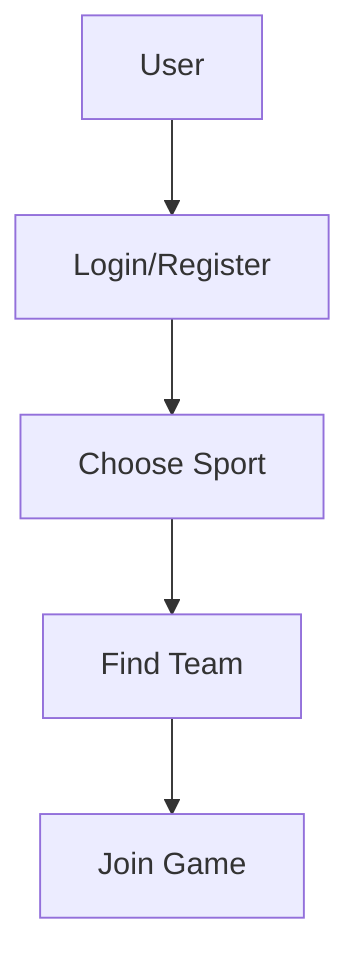

# TeamConnects

**Project:** TeamConnects – Connecting Teams for Sport  

**Status:** In Development

## 🎯 Project Overview

**TeamConnects** is a web application that connects athletes and recreational players by **location and sport**.

It addresses a common problem: people often want to play football (or other sports) but can't find enough players to form a team.

The goal is to allow users to easily register, choose a sport, and find a team or teammates **near their neighbourhood (e.g. Split, local districts)**.

If users can search for teams by sport and location, they'll more easily find teammates and increase their sporting activity.

**App flow**: Register → Choose sport → Browse teams → Join a team

The app is designed for anyone who:
- wants to play but doesn't have enough people for a team,
- is looking for sporting activities in their area,
- wants to join existing teams or leagues.


## 🛠 Tech Stack

- HTML, CSS, JavaScript
- Node.js (backend)
- Express.js (API)
- Supabase or JSON files (user and team storage)
- Git & GitHub (version control)
- Visual Studio Code

## 📋 Features

- User registration and login
- Sport and location selection
- Browse available teams
- Automatic team matching
- User profile management

## 🚀 Diagram



## ⚙️ Getting Started

1. **Clone the repository**:
   ```bash
   git clone [repository-URL]
   cd 2025-intro-swe/projects/teamconnect-danrog101
   ```

2. **Install dependencies**:
   ```bash
   npm install
   ```

3. **Run the app**:
   ```bash
   npm start
   ```
