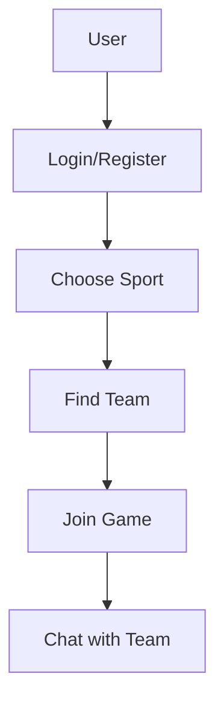

# TeamConnects

**Project:** TeamConnects – Connecting Teams for Sport  

**Status:** In Development

## 🎯 Project Overview

**TeamConnects** is a web application that connects athletes and recreational players by **location and sport**.

It addresses a common problem: people often want to play football (or other sports) but can't find enough players to form a team.

The goal is to allow users to easily register, choose a sport, and find a team or teammates **near their neighbourhood (e.g. Split, local districts)**.

**App flow**: Register → Choose sport → Browse teams → Join a team

The app is designed for anyone who:
- wants to play but doesn't have enough people for a team,
- is looking for sporting activities in their area,
- wants to join existing teams or leagues.

## 🛠 Tech Stack

- React (frontend)
- Node.js + Express.js (backend)
- Supabase (database)
- Socket.io (real-time chat)
- Render (hosting)
- Git & GitHub (version control)

## 📋 Features

- User registration, login and email verification
- Sport and location selection
- Browse and filter available teams
- Join teams with skill level requirements
- Real-time team chat
- Direct messages between friends
- Tournament system
- Rating system per sport
- Trainer studio management
- Field map
- Notifications
- Dark/light mode + HR/EN language support

## 🚀 Diagram


## ⚙️ Getting Started

1. **Clone the repository**:
```bash
   git clone [repository-URL]
   cd teamconnects
```

2. **Install dependencies**:
```bash
   npm install
```

3. **Set up environment variables** — create `.env` in backend:
```
   SUPABASE_URL=your_supabase_url
   SUPABASE_KEY=your_supabase_key
   JWT_SECRET=your_jwt_secret
   EMAIL_USER=your_email
   EMAIL_PASS=your_email_password
   FRONTEND_URL=http://localhost:3000
```

4. **Run the app**:
```bash
   # Backend
   cd backend && npm start

   # Frontend
   cd teamconnect-app && npm start
```

## 🌐 Live Demo

- Frontend: https://teamconnect-frontendte.onrender.com
- Backend: https://teamconnect-cd34.onrender.com